# **Predicting Football Player Transfer Values**


Project by: **Sanjit Varma**


# Table of Contents
* [Business Problem](#business-problem)
* [Obtaining the Data and Cleaning](#obtaining-the-data-and-cleaning)
* [Model Training and Testing](#model-training-and-testing)
* [Conclusions](#Conclusions)
* [Contributor](#contributor)
* [Project Structure](#project-structure)


# Repository Links
* [Data](/data)
* [Python scripts](/tools)
* [Images](/images)
* [Scraping](/notebooks/scraping)
* [Cleaning](/notebooks/cleaning)
* [Models](/notebooks/modeling)


# Business Problem


With the arrival of more lucrative sponsorship deals, TV broadcasting contracts and increased investment from wealthy team owners, there has never been more money flowing into the football industry than ever before. As a result of this, the transfer market for players has seen an exponentially high level of inflation over the past decade. When Paris Saint-Germain (owned by the Qatar government) paid a shocking reported fee of [£200 million](https://www.skysports.com/football/news/11820/10972928/neymar-signs-for-paris-saint-germain-from-barcelona) in the summer of 2017, it caused a significant rise in player values across the market as a new benchmark had been set. For several years, any price over the £80 million to £90 million range (the range for the previous [three world record transfer fees](https://en.wikipedia.org/wiki/List_of_most_expensive_association_football_transfers#Highest_transfer_payments_in_association_football) paid) for a single player would have been unthinkable. 


Today, there are 8 players whose base values are worth that price or more; with the world’s most valuable player, Kylian Mbappe worth a staggering £144 million despite only having a year left on his contract.  Seeing these high prices, one may start to wonder if they have anything to do at all with the respective players’ on-field performances. What is it about players like Kylian Mbappe, Erling Haaland and Harry Kane that make them the most valuable players in the world? Of course, they are all very good players but can their on-field performances truly be the conclusive determinants for their market value? These are questions that we hope to answer using machine learning as we see how well we can use players’ on-field performance metrics to predict their current transfer value – i.e. Players’ market value as of September 1st 2021 (the day after the Summer transfer window closed).


# Obtaining the Data and Cleaning

In order to complete this project, two sources of data were identified: -

* *[FBREF](https://fbref.com/en/)- for detailed on-field performance data*
* *[Transfermarkt](https://www.transfermarkt.co.uk/)- for information regarding player transfer values*


## FBREF


Fbref.com consists of data tracking the on-field performance metrics of football players competing in the major leagues across the globe. The data collected by the website is most comprehensive from the start of the 2017-18 season. The years before that have either fewer metrics or just no data available at all. Therefore, it was decided that it would be best to use data starting from 2017 until 2021 for the sake of consistency.

While the website does consist of data for player performances from several leagues across the globe, the leagues that had the most comprehensive data were the English Premier League, Spanish La Liga, Italian Serie A, German Bundesliga and the French Ligue 1. Hence, it was concluded that data should be gathered for each of the top 5 leagues over the previous four seasons. 

The reason for selecting performance data from previous years is because we want to test the assumption that players’ performance data over recent years will have a significant impact on their transfer values. 

For each league, there are 10 different datasets measuring various facets of a player’s game. The datasets are named as follows:

* Standard Stats
* Goalkeeping
* Advanced Goalkeeping
* Shooting
* Passing
* Pass Types
* Goal and Shot Creation
* Defensive Actions
* Possession
* Miscellaneous Stats

Given that Goalkeepers are judged based on entirely different metrics when compared to outfield players, a decision was made not to include goalkeepers in this project. Therefore, the two datasets related to Goalkeeper performance have been ignored.

Below is an overview of the remaining datasets:

* [Standard Stats](https://fbref.com/en/comps/9/stats/Premier-League-Stats): As its name infers, this dataset consists of standard information about each player’s age, playing time and other basic information like goals scored and assisted, expected goals and assists, number of yellow/red cards etc.

* [Shooting](https://fbref.com/en/comps/9/shooting/Premier-League-Stats): Information regarding players’ shots from a quantitative as well as qualitative standpoint.

* [Passing](https://fbref.com/en/comps/9/passing/Premier-League-Stats): Information regarding the quantity and quality of passes cumulatively as well as separated into sections based on pass distance (i.e. Short, Medium and Long distances)

* [Pass Types](https://fbref.com/en/comps/9/passing_types/Premier-League-Stats): Information regarding the type of passes attempted and their respective outcomes (i.e. aerial/medium-level/ground level height and body part used to make the pass). In order to limit an already high number of features to use; **this dataset was not utilized** as it was decided based on domain knowledge that the body parts used by a player to make a pass or the height at which players make passes are unlikely to be a major determinant of a player’s price.

* [Goal and Shot Creation](https://fbref.com/en/comps/9/gca/Premier-League-Stats): Information regarding players’ actions that have led to shot taking opportunities and goals.

* [Defensive Actions](https://fbref.com/en/comps/9/defense/Premier-League-Stats): Information regarding the defensive aspects of a player’s game and also information about how their defensive efforts contributed to the team winning the ball back and creating a goal-scoring opportunity for the team as a result.

* [Possession](https://fbref.com/en/comps/9/possession/Premier-League-Stats): Information regarding the player’s ability to progress the ball and impact the proceedings of the game.

* [Miscellaneous Stats](https://fbref.com/en/comps/9/misc/Premier-League-Stats): Miscellaneous on-field performance information such as number of direct red cards, second yellow cards, fouls committed/drawn, offsides etc.


Thankfully, the website provides an easy option to download the data as an Excel Spreadsheet-therefore making our task much more straightforward. The selected datasets described above were downloaded as Spreadsheets for each season between 2017 and 2021 (4 seasons) for every division in Europe’s most popular 5 leagues.


### Combining all 4 Seasons Data into a Single FBREF Dataframe ([See here for Notebook](/notebooks/cleaning/combining_fbref_data.ipynb))

Now that I had gathered [data](/data/league_data) for 4 seasons across each of Europe’s top 5 leagues, I had to decide on my approach towards combining all the downloaded spreadsheets (there were 140 of them- i.e. 7 dataframes x 4 seasons x 5 leagues)  into a single dataframe.

Finally I decided that the following would be the best approach:

1.	Take a specific season (e.g. 2020-2021 season).

2.	Each league has 7 different datasets containing information for that specific season.

3.	Use pd.concat() to stack data from all 5 leagues for a given dataset on top of another. i.e. s21_std is a dataframe that has the “Standard Stats” datasets for the 2020-2021 season for each league stacked vertically on top of one another. This was done for every dataframe for every season. Finally, we were able to combine our 140 spreadsheets into 28 dataframes (7 datasets * 4 seasons).

4.	At this stage a major issue was discovered in our dataset: Players who transferred midseason to a different team would appear twice in our dataset. To tackle this problem, a function was created for each dataset that would aggregate the two rows for these players into one.

5.	After fixing this issue, the 7 datasets for each season were combined into 1 dataframe for each season by doing a “left”, “right” merge on the common column-“Player” and combining them horizontally next to each other. This helped create one dataframe for each season that had all data for every player for each season. Finally, we were left with 4 dataframes (1 for each season).

6.	An important factor to consider for the next step is that there are several players who do not feature in each of the 4 seasons we are looking at. i.e. Players may have only played 1-3 seasons for a team in the top 5 leagues over the past 4 years. Also, there are players who made their debut 1-3 seasons ago. As a result of this, we could not do a simply pd.merge(on=”Player”) like before since this method drops values where a common value is not found in the selected mutual column. Therefore, I used pd.merge() with the parameter “how=’outer’” because this makes the merge use a union of keys from both the frames. This would mean that instead of dropping rows that do not appear in other dataframes, they would simply show up as nan values for another season in which the player did not participate within the top 5 leagues.

7.	Finally, after the previous step we are left with one whole dataframe that combines information from 140 different spreadsheets. This [final dataframe](/data/Complete_FBREF.xlsx) consists of all the data downloaded from fbref with each season’s data stacked next to each other horizontally.

This concluded my collection and processing of the data from fbref.com.


## Transfermarkt 


Transfermarkt.co.uk provides users with information about a player’s:

* *Age*
* *Nationality* 
* *Height*
* *Preferred Foot* 
* *Date Joined Current Team*
* *Previous Team*
* *Date of Contract Expiry*
* *Current Market Value*

It was decided upon looking at this information, that a player’s height, preferred foot, previous team and the date they joined the current team would not be significant determinants of a player’s value.

Therefore, the information that we want to gather from this website would be:

* *Player Name*
* *Current Team*
* *Domestic league in which player’s team competes*
* *Age*
* *Playing position*
* *Nationality*
* *Years Left on Contract*
* *Transfer Value (the target variable for this project)*


### Creating a list of webpage links to iterate through ([See here for Notebook](/notebooks/scraping/scraping_transfermarkt.ipynb))


To scrape the data from this website, the popular Python scraping library BeautifulSoup was used. Given that there are 98 different teams within Europe’s top 5 leagues, we would need to scrape data from 98 different pages. Given that manually creating a list of links for 98 different webpages would be a painful endeavor, [this page](https://www.transfermarkt.co.uk/wettbewerbe/europa) consisting of a tabular list of the top European Leagues was scraped using the ‘find_all()’ method to get the links of the top 5 leagues’ webpages.


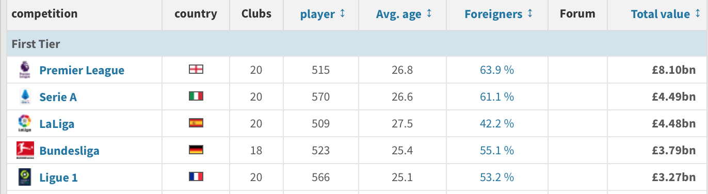


A decision was made at this point that given we already collected player performance data from previous years, we only want to include clubs that were participating in their respective nation’s top division in the previous season (2020-2021). i.e. When scraping the links to the webpages of the top 5 leagues, each webpage consisted of a list of teams participating in the top division for the (2021-2022) season. Therefore, teams relegated in the previous season were replaced by newly promoted teams in each league’s respective webpage. To tackle this issue, the subdirectory of the link: "/plus/?saison_id=2021" was removed using the split() method and was replaced with "/plus/?saison_id=2020" by simply adding it to the website domain string.

Having done this, we had five different links ([Premier League](https://www.transfermarkt.co.uk/premier-league/startseite/wettbewerb/GB1/plus/?saison_id=2020), [Serie A](https://www.transfermarkt.co.uk/serie-a/startseite/wettbewerb/IT1/plus/?saison_id=2020), [La Liga](https://www.transfermarkt.co.uk/laliga/startseite/wettbewerb/ES1/plus/?saison_id=2020), [Bundesliga](https://www.transfermarkt.co.uk/bundesliga/startseite/wettbewerb/L1/plus/?saison_id=2020), [Ligue 1](https://www.transfermarkt.co.uk/ligue-1/startseite/wettbewerb/FR1/plus/?saison_id=2020)) to webpages consisting of teams participating in that respective nation’s top division in the 2020-2021 season. From this point it was pretty straightforward to scrape the links to each team’s webpage across all five nations. 


### Scraping a Club’s webpage

Having decided earlier exactly what information we wanted to gather, the find_all() method was used extensively to filter a team’s webpage ([example](https://www.transfermarkt.co.uk/olympique-lyon/startseite/verein/1041/saison_id/2020)) for specific tags and unique attributes. Through this approach, it was easy to collect all the data we wanted from the above list except for Contract information. Admittedly, at the time of scraping endeavor I did not have extensive experience working with html before. For some reason, I was unable to locate the ‘Contract’ column in the page’s source despite multiple efforts trying to find the object manually.

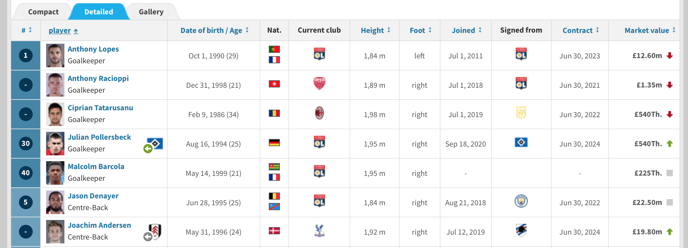

### Gathering Contract Length Data

Given my domain knowledge, I was confident that the number of years left on a player’s contract could be an important factor in determining a player’s value and therefore I decided not to give up on this feature and worked on an alternative approach.

I used the loop I made previously to gather a list of links for all 98 links and built another loop using those teams’ links by scraping the links to each player’s webpage ([example](https://www.transfermarkt.co.uk/cristiano-ronaldo/profil/spieler/8198)) within each club’s webpage. Thankfully, I was able to find the contract expiry dates for players on their respective webpages using the help of the. find_all() method. However this proved to be a problematic approach as certain players seemed to have their respective webpages oriented differently; thereby making a loop iterating through every player’s weblink halt due to an error. I made use of an Exception Handler to bypass this issue and found that out of 2643 players, my loop failed to get the contract length information for 89 players (a relatively small number of players who we can afford to drop).


When scraping the contract expiry date for each player, only the expiry year was taken and subtracted from the year 2021 just so that we can see more easily how many years are left on each player’s contract.

Once I had all the contract length data that could be gathered, I used the pd.merge(df1,df2,on=”Player”) method to combine it with the dataframe consisting of all the other information. 

Finally, this concluded my task of scraping Transfermarkt.co.uk.


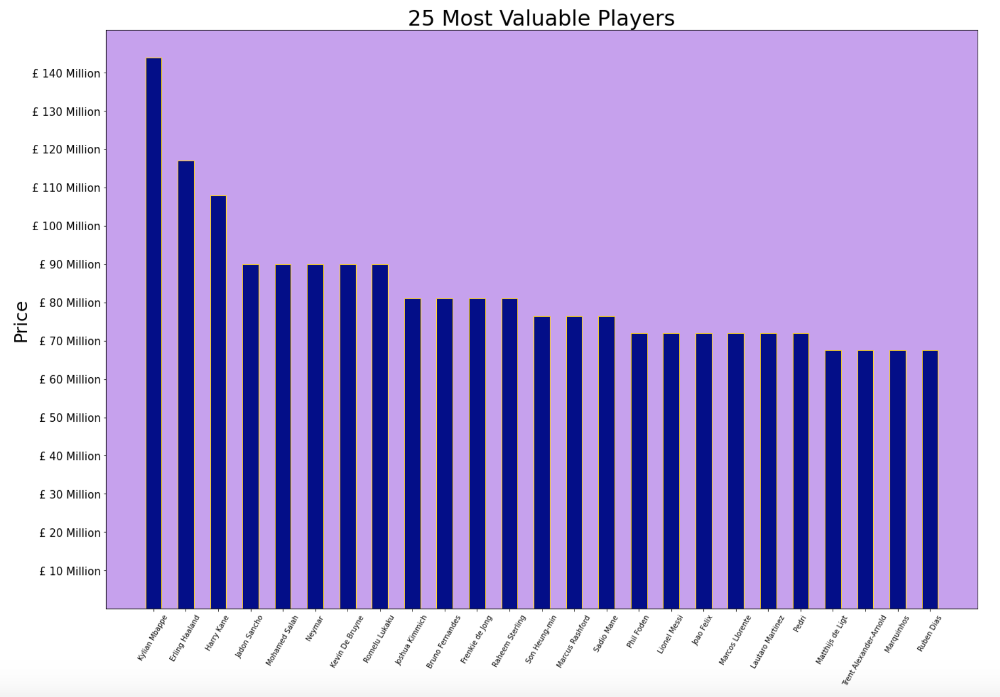


## Combining FBREF and Transfermarkt data ([See here for Notebook](/notebooks/cleaning/combining_all_data.ipynb))


Having gathered the necessary data from both of my sources, the next step was to combine the FBREF and Transfermarkt data into one final dataframe. At first this seemed like it should be a straightforward task as I felt I could simply use a pd.merge() combing the two dataframes on the common “Player” column for both my Fbref and Transfermarkt datasets. However, when doing this more than half my dataset would disappear and I was left with around 600 players. I realized soon after this that the problem lies with the different formats in which players are named in each dataset. For example, players like ‘Pascal Groß’ or ‘Martin Ødegaard’ had special characters in their names in one of the datasets while their names in the other dataset were stored as ‘Pascal Gross’ or ‘Martin Odegaard’. Also, players such ‘James Ward-Prowse’ would have a ‘-‘ in their names in one dataset while it was missing in the other. 

In order to combat this issue, I wrote a helper function called [clean_char()](/tools/helpers.py). This function first gathers a list of all the special characters found in all players’ names. Then I added a list of characters that I want to replace each of those special character with. The function then iterates through every player’s name and replaces any special character with their corresponding ‘cleaner’ character. 

Finally, I did a merge with my special character-free datasets and found that a lot of the players that were missing from my previous dataset had finally made it this time around. However, there were still several important players missing because of another reason. Some players had their first and last name written (eg. Heung-min Son vs Son Heung-min) in a different order, while other players had a middle name included in one of the datasets (eg. Jose Gaya vs Jose Luis Gaya). Given the time constraints of my project, I simply decided to manually change the names of players in the dataset. There were a few hundred of them so I decided to focus on the players with the highest transfer values as I did not want to exclude them from my dataset. Finally, after manually changing about 100 names, I decided that the rest of the players all of whom were valued under £5 million were not really necessary as I already had an excessive number of players within that price range. Having completed this cleaning step, I combined all my data into a [final single dataframe](/data/final_dataset.xlsx).


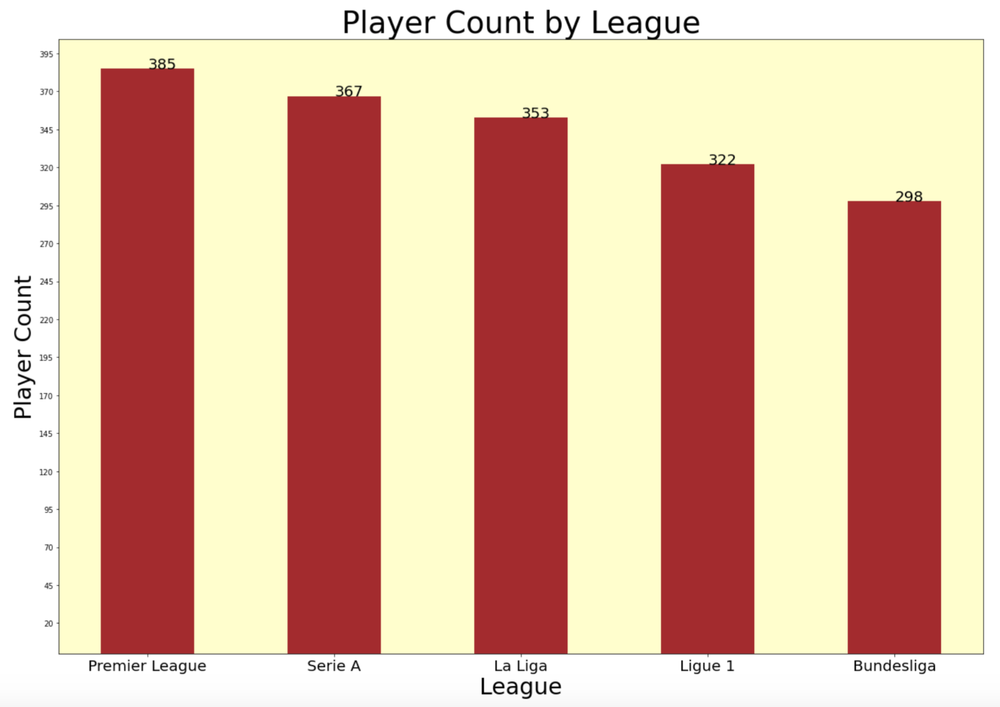


## Dealing with Nan Values ([See here for Notebook](/notebooks/cleaning/filling_nan_values.ipynb))


As mentioned earlier, when creating a unified FBREF dataframe, players who did not compete in the top 5 leagues for each of the 4 recorded seasons would have their performance metrics appear as Nan values in columns for a season they did not compete in. eg. Erling Haaland did not participate in a top 5 European League until the 2019-20 season when he transferred from Red Bull Salzburg to Borussia Dortmund. Therefore, the columns measuring 2017-18 and 2018-19 data consist of Nan values in the row featuring Haaland. When fitting data into a model, rows containing Nan values are rejected and we do not want to lose too much data because of this Nan problem. Therefore, I wrote a custom function that takes the average values for each metric from seasons where the player competed in the top 5 divisions and replaced the Nan values with these numbers. I did not want to do a simple fillna() with the average of the column as I did not want players’ Nan values to be based off other players’ performances. That’s why I wrote this function to ensure that any missing data for a player is replaced with the average of their own recorded performances. In this [no_nans dataset](data/no_nans_data.xlsx),I also removed all goalkeepers since there aren't enough rows of goalkeeper data in our dataset to train a machine learning model. Therefore, goalkeepers are not within the scope of this project.


# Model Training and Testing


## Pre-Processing

Having collected and combined a clean dataset, I was keen to check if the dataset was prepared to meet the assumption of most models that the predictor columns have a Gaussian normal distribution. I filtered a dataset that consists of only attacking players and then looked at the distribution of certain predictor features that could be used to predict attackers’ transfer values. The visual below shows us how the features are distributed:

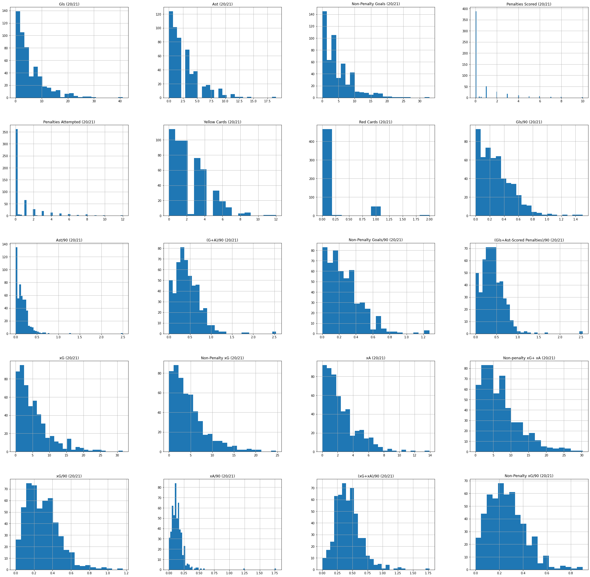

As we can see, the features above which are likely to be important predictors of an attacking player’s value seem to all have a significant left-skew in their distribution of values. This shows that the features in our dataset would need to be transformed to produce a more Gaussian-like normal distribution before they can be used to fit and train our models. 

In order to achieve the desired Gaussian-like normal distribution in our features, the PowerTransformer was used from the sklearn preprocessing library. It is a tool that transforms data to be more-Gaussian like and helps with modeling issues such as prevalence of heteroscedasticity (non-constant variance)

Power transforms are a family of parametric, monotonic transformations that are applied to make data more Gaussian-like. This is useful for solving modeling issues with data that is heteroscedastic, where the variance in the data across the predictor column is not constant. The PowerTransformer used the ‘yeo-johnson’ method by default to transform the data.

After making the distribution in our features normal, a Robust Scaler was used to standardize the data. The Robust Scaler is particularly useful when dealing with features where outliers are present. It removes the median and then scales the column data according to quantile range. The IQR (interquartile range) is the range between the 1st quartile (25th quantile) and the 3rd quartile (75th quantile).
Standardization data is an important requirement for several machine learning predictors. Typically, this is achieved by removing the mean and scaling to unit variance. However, outliers in the data can often affect the sample mean / variance in an undesirable manner. In such situations, the usage of a median and an interquartile range can often give better results.


## Modeling Workflow

Given our assumption that player values are likely determined by different attributes based on their playing position, the table was divided into three dataframes: Attack, Midfield and Defence. In each notebook, it can be seen that a modeling workflow to predict transfer values was first created for the attacking players’ dataset. Once a workflow had been established, the same process of modeling steps and printing results was repeated for midfielders and defenders.


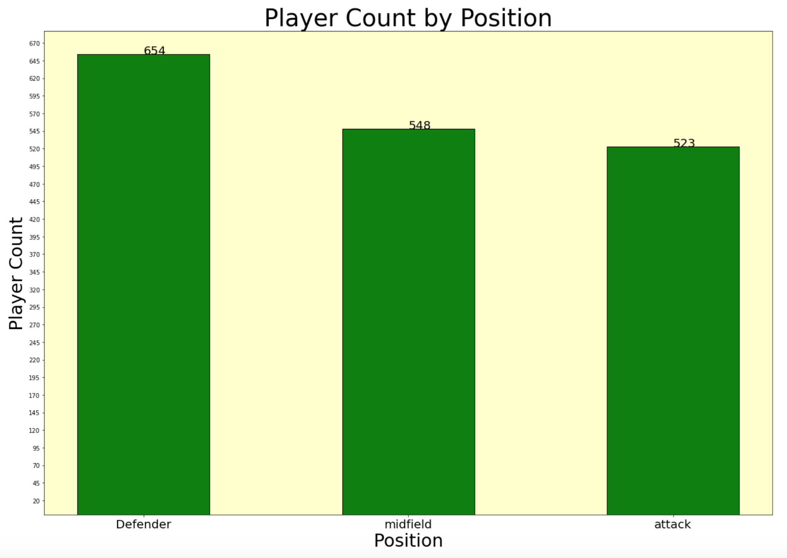

The visuals below show some of the top correlated features with player transfer values for each of our three main positions.

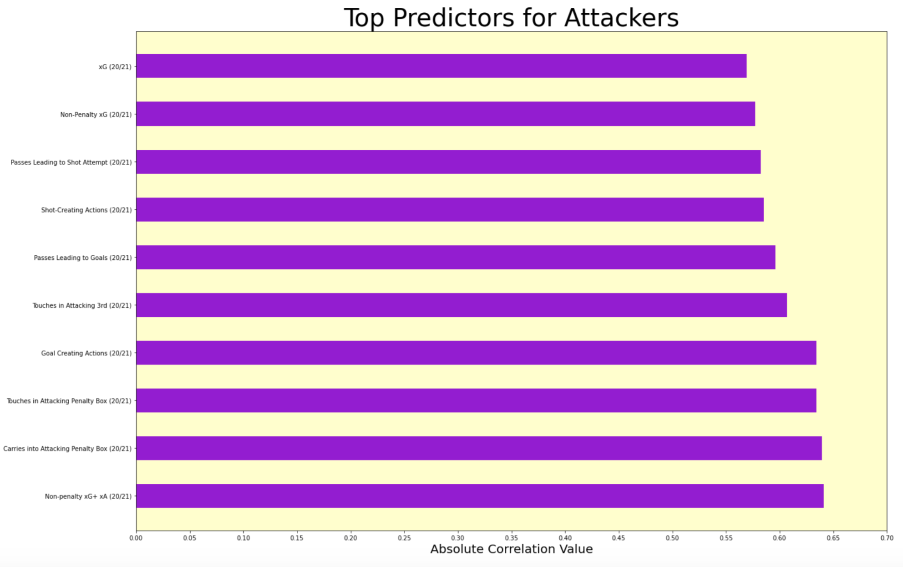

Unsurprisingly for attackers, a player's expected goals & assists, activity in the opposition penalty box and chance creating abilities are top predictors.

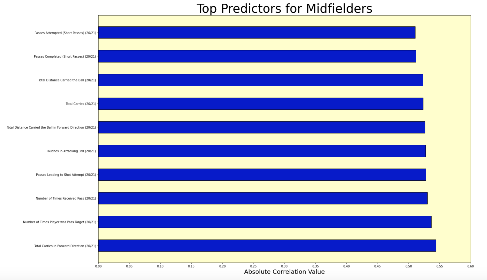

In the case of midfielders as well, it isn’t surprising to see that they are judged on their ability to dictate the tempo of the game and positive facilitate the ball progression of the team.

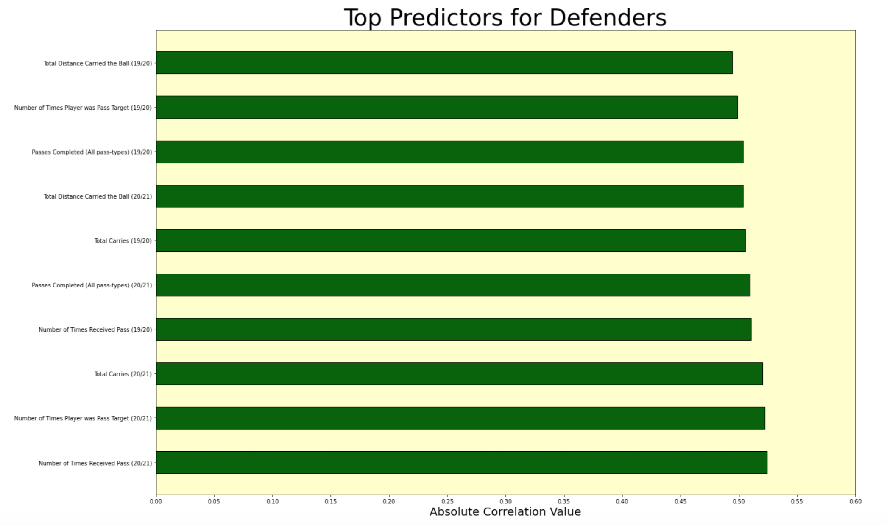

In the case of defenders, it is interesting to see that the number of tackles/interceptions made are not among the top predictors. This may be because top defenders play in stronger teams that possess the ball for longer periods, therefore they do not need to make as many tackles/interceptions.

Correlation was not used as a means for indentifying the top features for every model (except linear regression). Given that each model had a different approach to training the data; the data was fit into an initial rendition of the model and then its most important features were identified with the 'feature_importances_' attribute. The above visuals are just to provide us with an understanding of what features have the highest correlation with player values from each position.


## Models Used

For this project, 8 different models were used to help predict players’ transfer values. All of them had data pre-processed fit using the steps mentioned above. In each case, the models were first used with their default hyperparameters. The first modeling attempt in each workflow would also use all features in the dataset. The purpose of doing this was to get and understanding of what features were deemed most important by the models. Once these top 10 features were determined, a newer version of the same model was run with a dataset that only consisted of the most important features. This is because a GridSearch was conducted to identify our best parameters; and performing a GridSearch with a dataset consisting of over 500 features would be computationally very expensive and time-consuming. Hence, only the top features were chosen for our final models and after better hyperparameters were identified through a GridSearch, a new model was fit with these hyperparameters and the top features in the dataset. After this the mean cross_val_scores were calculated with ‘neg_root_mean_squared_error’ as the scoring metric. Ideally, we want an RMSE value as close to 0 as possible. 


* [Linear Regression](notebooks/modeling/linear-l1-l2.ipynb)

* [Lasso (L1) Regression](notebooks/modeling/linear-l1-l2.ipynb)

* [Ridge (L2) Regression](notebooks/modeling/linear-l1-l2.ipynb)

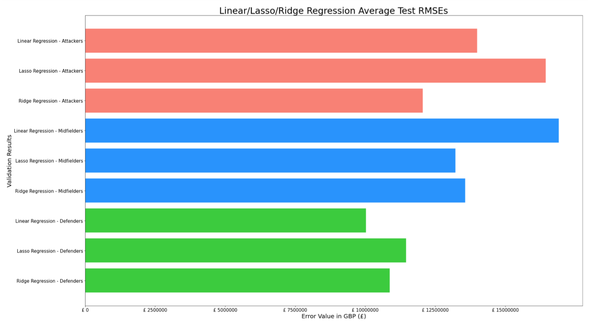

* [DecisionTreeRegressor](notebooks/modeling/DecisionTree.ipynb)

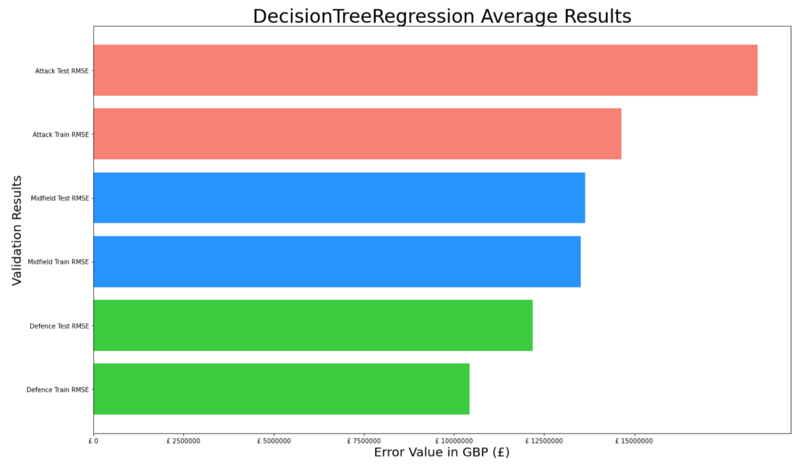

* [RandomForestRegressor](notebooks/modeling/RandomForest.ipynb)

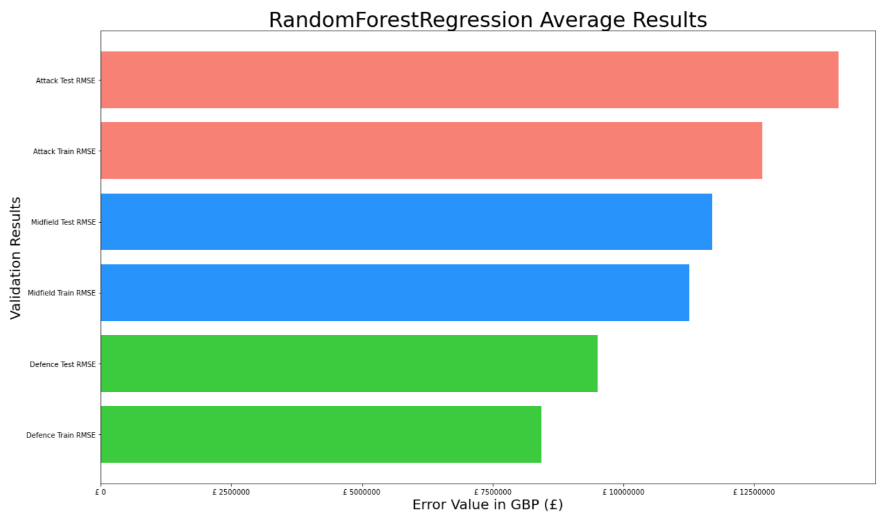

* [GradientBoostingRegressor](notebooks/modeling/GradientBoost.ipynb)

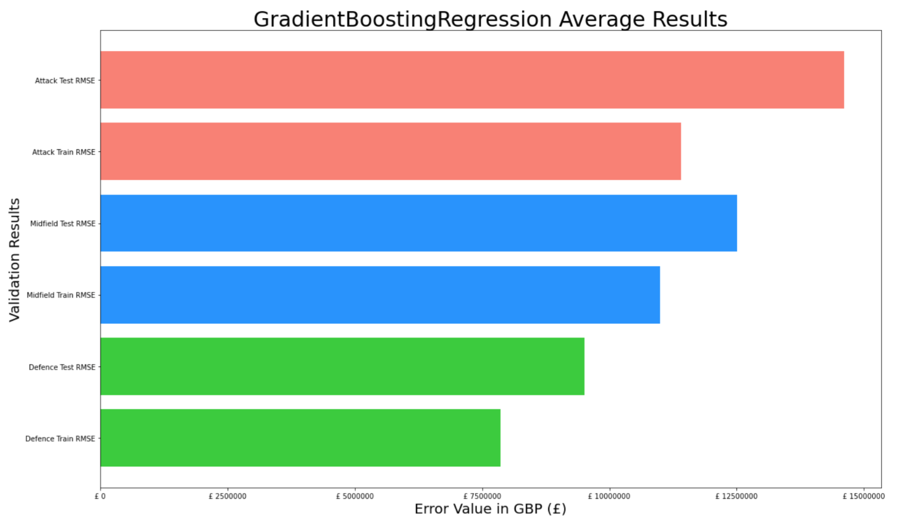

* [AdaBoostRegressor](notebooks/modeling/AdaBoost.ipynb)

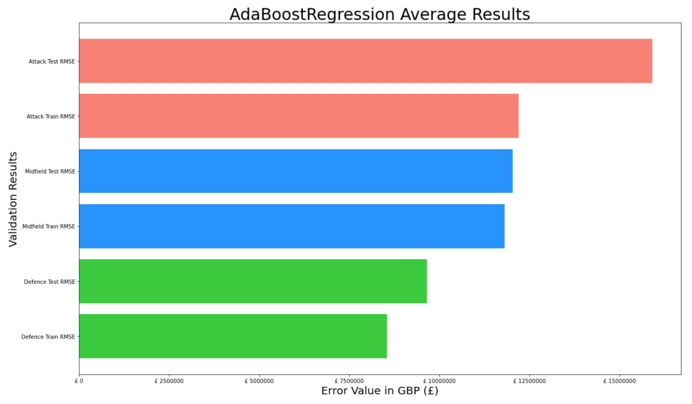

* [Support Vector Regressor](notebooks/modeling/SupportVectorRegressor.ipynb)

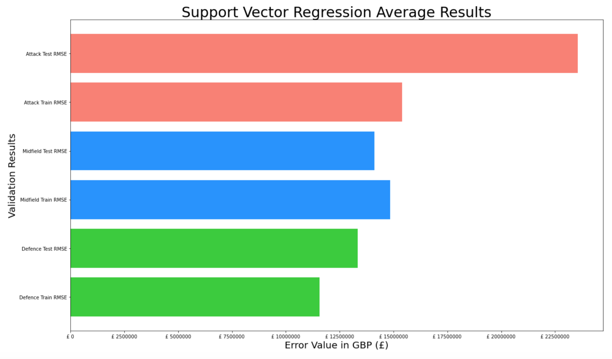


# Conclusions

Having concluded modeling for this project, the results for each model were compared to identify which model worked best to predict player transfer values with the lowest Root Mean Squared Error for each position.

### Best models for each position

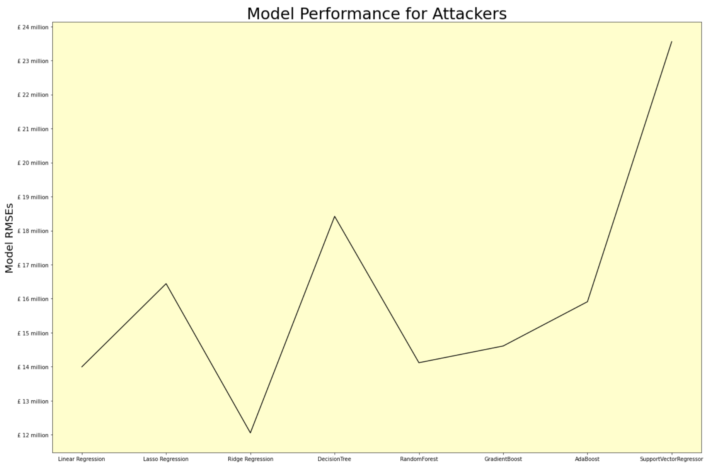

The Ridge (L2) Regression produced the lowest Root Mean Squared Error in its predictions for Attacking players.

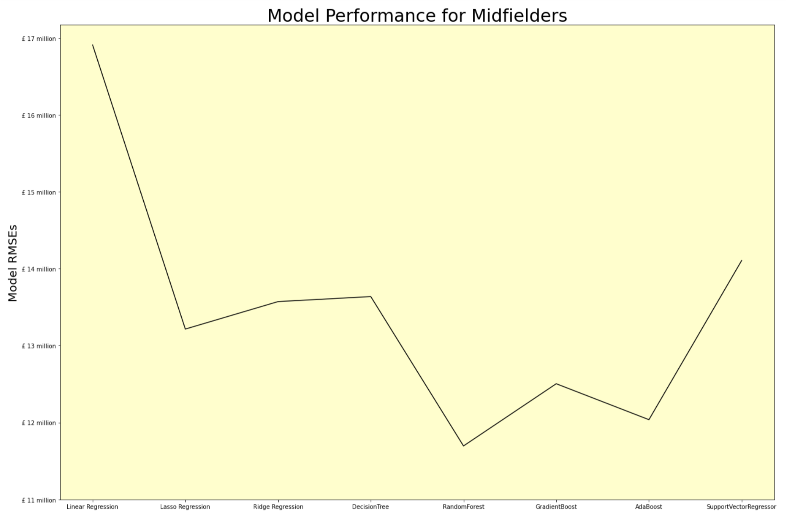

In the case of Midfielders, the Random Forest Regressor produced the lowest Root Mean Squared Error.

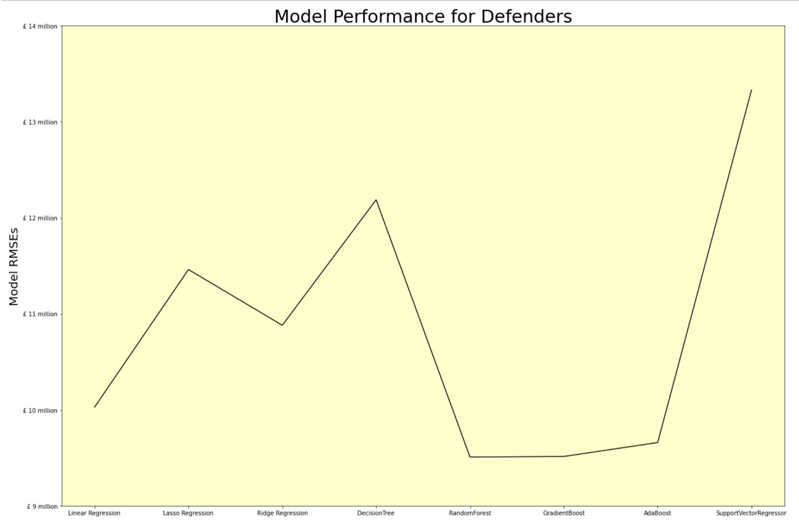

And for Defenders, the three ensemble models (Random Forest, Gradient Boost & Ada Boost) produced similar results. But among them, the Random Forest Regressor was the model producing the lowest Root Mean Squared Errors.

### Identifying which positions we predicted best

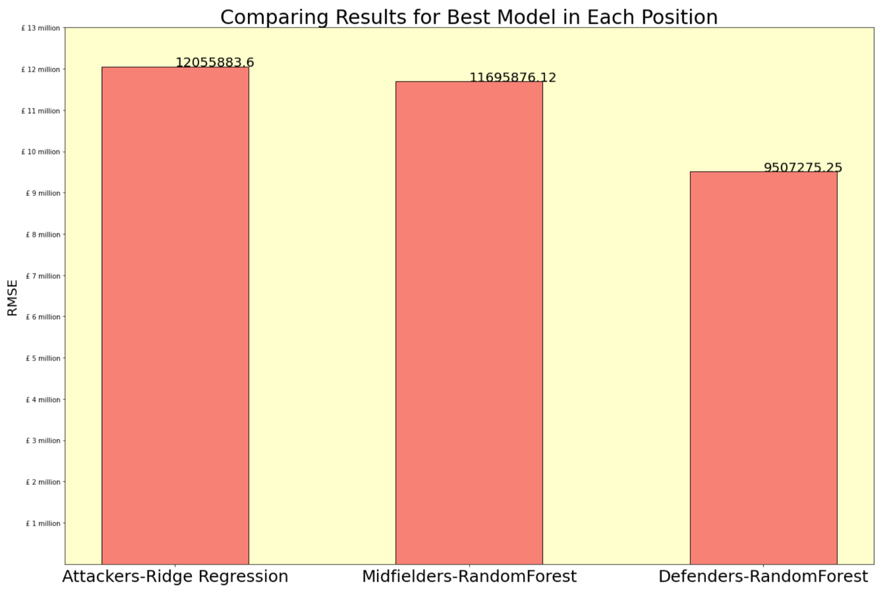

Our models have an error of around £9 million - £12 million with our models able to predict Defenders' prices best, given it has the lowest RMSE score. While this may be acceptable for larger clubs looking to purchase the best players (who are worth 10s of millions), the findings of this project tell us that our models are not good enough for mid-tier and lower value players who are worth £20 million or less. Therefore, we may conclude that data of just a player's on field performance may not be enough to accurately predict player transfer values. More data may be required to achieve this goal.


Given the short time frame for this project, there are several limitations that will need to be worked on.

First, is the assumption that all top 5 leagues in the competition are equally competitive (which is not true); also players in better teams tend to have better stats. Therefore, we need to find a better way to factor this into our data. Perhaps a coefficient score could be identified based on strength of teammates and opposition in each match. This would be time-consuming but is possible as there is data available.

Another assumption fallacy in this project is that in the modern game, player positions are not divided into 3 categories, There are a diverse set of player roles within each position so the data will need to be divided to factor this in. i.e. attacking/defensive midfielders, wingers/strikers, centerbacks/fullbacks etc. 

Given our conclusion that on-field performance is not the only predictor of player value, more data needs to be gathered such as (a player's int'l caps, number of Google searches with their name, overall career history, trophies won etc.)


# Contributor


**Sanjit Varma** <br>
    **Github**: www.github.com/sanjitva<br>
    **Linkedin**: www.linkedin.com/in/sanjit-varma-624ba410a/<br>
    **Email**: sanjitva@gmail.com


# Project Structure


```
├── eda.ipynb
├── README.md
├── slide_deck.pdf
├── data
├── images
├── notebooks
|   ├── cleaning
|   ├── modeling
|   └── scraping
| 
└── tools
    ├── __init__.py
    └── fbref.py
    └── feature_eng.py
    └── helpers.py
```

